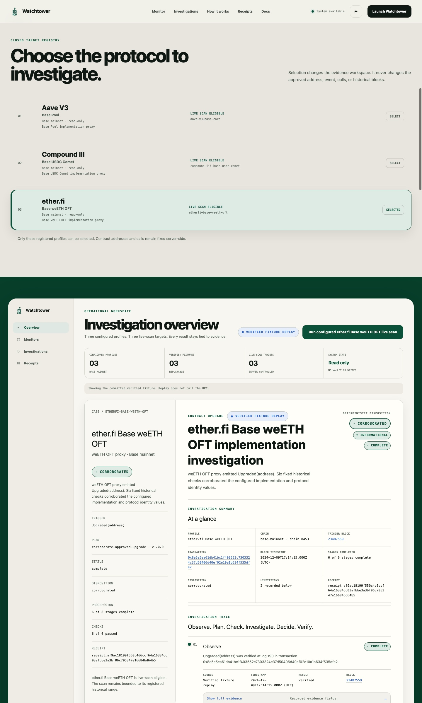

# Watchtower

## Product promise

**What Watchtower does**

Watchtower investigates a configured Base protocol upgrade at the exact
historical block where it occurred. It checks the trigger, historical proxy
state, implementation bytecode, and protocol-specific evidence, then produces a
deterministic disposition and browser-verifiable receipt.

It is read-only, bounded, and does not claim that an upgrade is safe,
legitimate, or intentional.

### Why this matters

When a protocol upgrades, the on-chain event tells you that its implementation
changed.

It does not tell you what was running before, whether the new code exists, or
whether the protocol still matched its expected setup at that exact moment.

Watchtower investigates that gap using the proxy's historical state, deployed
bytecode, and protocol-specific checks at the upgrade block.

## Live demo and public links

- [Open the live demo](https://watchtower.ajkadri.dev/)
- [Read the documentation](https://watchtower.ajkadri.dev/docs)
- [View the GitHub repository](https://github.com/AjKadri/watchtower-agent)
- [Follow Watchtower on X](https://x.com/watchtowerbase_)
- [Join the Watchtower Telegram](https://t.me/watchtowerbase)
- [Run the demo locally](#local-setup-and-tests)

The live demo supports the three committed, verified fixture replays and live
scans for the configured Aave V3 Base Pool, Compound III Base USDC Comet, and
ether.fi Base weETH OFT profiles when the archive-capable Base RPC is available.
All three profiles also have verified fixture replays. The same bounded flow
can be reproduced locally.

## Verify it yourself in 60 seconds

1. Open the [live demo](https://watchtower.ajkadri.dev/).
2. Choose a configured Base profile.
3. Follow Observe, Plan, Check, Investigate, Decide, and Verify.
4. Open the evidence trace and inspect the exact block, transaction, and checks.
5. Open the receipt or review packet.
6. Recompute the canonical receipt ID in the browser.

All three profiles are configured for live scanning and have verified fixture
replays. The live path requires an archive-capable Base RPC endpoint.



## What Watchtower checks

The registry is deliberately narrow. Each investigation uses the server-selected
profile, qualifying transaction, event, block range, and versioned plan.

| Signal | What Watchtower checks | Why it matters |
| --- | --- | --- |
| Upgrade trigger | The configured proxy emits `Upgraded(address)` in the approved transaction and block. | Establishes the precise implementation-change event. |
| Historical proxy state | The EIP-1967 implementation slot at block N-1 and block N. | Compares the proxy state before and at the upgrade. |
| Implementation bytecode | Code presence and the recorded byte length or hash at block N. | Confirms that the decoded implementation has deployed code. |
| Aave V3 identity | `getPool()` at N and optional `POOL_REVISION()` checks at N-1 and N. | Corroborates the configured Pool proxy and revision values. |
| Compound III identity | `governor()` at N-1 and N, plus `baseToken()` at N. | Corroborates the configured Comet identity. |
| ether.fi identity | `endpoint()`, `token()`, and `sharedDecimals()` at N. | Corroborates the configured OFT identity. |

Ownership changes, pause or unpause events, transfers, treasury activity,
liquidity changes, wallet movements, dynamic discovery, and open-ended project
graphs are outside this MVP.

## Review packets and receipt proof

A completed investigation can be exported in two formats. Markdown and JSON
represent the same investigation.

The packet includes:

- the configured profile and chain
- the upgrade transaction and exact block
- trigger and implementation evidence
- fixed protocol-specific checks
- disposition and limitations
- the canonical receipt identifier

Markdown supports human review and annotation. JSON supports machine
consumption, archiving, and retention in an external audit trail.

The packet supports exchange and infrastructure teams reviewing integrations,
protocol teams reviewing upgrades, and crypto-agent companies that need
deterministic protocol evidence. Watchtower provides evidence for the decision.
It does not make the operational decision.

To verify a JSON packet, choose it in the dashboard's **Verify an exported
packet** control. Verification stays in the browser. It checks the packet
format and schema, ignores saved verification metadata, compares the packet and
canonical receipt identifiers, and independently recomputes the canonical
receipt ID with Web Crypto. No file is uploaded, fetched, or sent to an RPC.

Browser verification covers the canonical receipt inside the packet. Additional
packet context, display metadata, saved verification metadata, agent narrative,
links, and other fields outside that payload are not all hash-bound. A verified
receipt proves the recorded deterministic evidence path, not the safety or
legitimacy of an upgrade.

Watchtower does not pause deposits, approve integrations, declare upgrades safe,
generate LLM risk scores, or monitor arbitrary contracts.

The core path is:

```text
bounded historical investigation
→ deterministic evidence
→ explicit disposition
→ verifiable receipt
```

## Supported profiles

Watchtower has a closed registry of three profiles. Clients cannot submit an
address, RPC URL, event signature, call, plan, or block range outside the
server-selected profile.

| Profile | Verified upgrade | Fixed protocol checks |
| --- | --- | --- |
| Aave V3 Base Pool | [Block 41105890](https://basescan.org/block/41105890) | EIP-1967 implementation before and after, implementation bytecode, `getPool()`, optional `POOL_REVISION()` before and after |
| Compound III Base USDC Comet | [Block 40235590](https://basescan.org/block/40235590) | EIP-1967 implementation before and after, implementation bytecode, `governor()` before and after, `baseToken()` |
| ether.fi Base weETH OFT | [Block 23487559](https://basescan.org/block/23487559) | EIP-1967 implementation before and after, implementation bytecode, `endpoint()`, `token()`, `sharedDecimals()` |

The committed fixtures contain real evidence from these three upgrades. Live
scanning is enabled for the configured Aave V3 Base Pool, Compound III Base USDC
Comet, and ether.fi Base weETH OFT profiles. All three profiles also have
verified fixture replays.

## Architecture and technical detail

### Six-stage investigation

1. **Observe.** Verify the configured proxy, transaction, log, topic, and
   decoded implementation.
2. **Plan.** Choose exactly one immutable versioned plan with a fixed capability
   and read budget.
3. **Check.** Read implementation state at N-1 and N and confirm bytecode at N.
4. **Investigate.** On a configured live Aave, Compound, or ether.fi scan, the
   bounded agent may request only remaining check IDs from the selected plan.
   Deterministic code resolves and executes every RPC parameter.
5. **Decide.** Deterministic rules derive severity and the final disposition
   after every required plan check has executed.
6. **Verify.** Bind the trigger, plan, checks, limitations, links, and
   disposition into receipt v1 and recompute its SHA-256 ID in the browser.

The interface labels each result as `Live RPC investigation`, `Verified
fixture replay`, `Incomplete investigation`, or `Failed investigation`. A
replay never appears as a live scan.

### What the evidence proves

A complete investigation establishes that Watchtower observed the configured
upgrade event in the qualifying transaction, verified its block, transaction,
receipt, and log, and executed the profile's fixed historical checks at their
exact block tags.

Each receipt records:

- complete trigger evidence
- the selected versioned investigation plan and reason
- selected and skipped checks
- the fixed read and capability budget
- every RPC method, safe parameter, block tag, normalized result, assertion,
  status, measured check duration, and safe failure
- the final `corroborated`, `contradicted`, or `incomplete` disposition
- direct explorer links

The receipt ID is a SHA-256 hash of a canonical payload that excludes the ID
itself and measured `elapsedMs` fields. Timings remain in the receipt and API
response, but are not hash-bound because real execution duration varies between
otherwise identical replays. Server validation checks consistency across the
trigger, evidence, plan, checks, disposition, and links. The browser receipt
view normalizes Ethereum addresses and independently recomputes the ID with
Web Crypto. Equivalent address casing produces the same receipt ID.

Committed fixture replays do not invent runtime duration. Their trace states
`Timing not recorded for fixture replay` when a check has no measured fixture
timing. The ether.fi fixture and approved live canonical payload both recompute
to `receipt_af9ac18199f550c4d6ccf64a16334dd03afbbe3a3bf06c705347e16684bd64b5`.

These receipts prove the recorded observations and deterministic assertions.
They do not prove upgrade intent, governance legitimacy, implementation safety,
remote cross-chain safety, or the security of related contracts.

The final disposition, severity, assertions, and receipt hash are deterministic.
The model may choose approved follow-up order and produce a public narrative,
but it cannot supply RPC parameters or participate in the verdict path.

### Investigation outcomes

| Outcome | Meaning |
| --- | --- |
| `corroborated` | The configured trigger and required historical checks agree with the approved profile assertions. |
| `contradicted` | One or more required historical checks disagree with an approved assertion. |
| `incomplete` | Watchtower could not collect enough verified evidence to issue a complete disposition. |
| `failed` | The investigation could not begin or complete because of a safe structured upstream failure. |

A `corroborated` outcome records agreement between this bounded evidence set and
its configured assertions. It does not prove implementation safety, intent,
identity, governance legitimacy, or broader protocol security.

### System flow

```text
Closed target registry
        |
        v
Bounded viem Base reader -> runtime-validated chain evidence
        |
        v
Initial deterministic historical checks
        |
        v
Bounded agent selects registered follow-up check IDs
        |
        v
Deterministic executor completes every required plan check
        |
        v
Normalized alert, investigation, and canonical receipt
        |
        v
Express API and in-memory store -> vanilla investigation workspace
```

- TypeScript modules keep scanning, validation, planning, and receipt creation
  independent from Express.
- viem provides read-only Base JSON-RPC access.
- Zod validates configuration, chain evidence, scan results, and cross-object
  receipt invariants at runtime.
- A provider-neutral agent interface uses a fixed OpenRouter endpoint for the
  first adapter. Model decisions pass strict schemas and can select only
  registered check IDs from the active plan.
- Express exposes the API and static interface.
- Vanilla HTML, CSS, and JavaScript render the archive, investigation trace,
  evidence details, failures, receipt downloads, and browser-side receipt
  verification.
- Process memory is sufficient for the bounded scans and deterministic IDs.
  Committed fixtures provide the public archive.

### API

| Method | Route | Purpose |
| --- | --- | --- |
| `GET` | `/api/health` | Sanitized service health |
| `GET` | `/api/config` | Public server-selected profile configuration |
| `POST` | `/api/scans` | Run the approved bounded scan; optionally provide a registered live `profileId` |
| `GET` | `/api/scans/:scanId` | Read one in-memory scan result |
| `GET` | `/api/alerts` | List current in-memory alerts |
| `GET` | `/api/alerts/:alertId` | Read alert and evidence detail |
| `GET` | `/api/receipts/:receiptId` | Download a validated JSON receipt |

Run the configured default scan. To select a live-enabled profile explicitly,
send its registered `profileId` (Aave, Compound, or ether.fi):

```sh
curl -X POST \
  -H 'content-type: application/json' \
  --data '{"profileId":"aave-v3-base-core"}' \
  http://localhost:3000/api/scans
```

Scan response semantics:

- HTTP 201 for a complete scan
- HTTP 200 with the structured result for a partial scan
- HTTP 502 for malformed upstream data or a wrong-chain RPC
- HTTP 503 for other upstream availability failures
- HTTP 429 when another scan is already active in the process
- HTTP 415 for missing or unsupported content type
- HTTP 400 for malformed JSON, invalid fields, or invalid approved bounds
- HTTP 413 for request bodies larger than 16 KB

Structured scan results and safe failures remain available in non-2xx scan
responses. Provider URLs, credentials, response bodies, and stack traces are
never included.

The public API permits one active scan per process and applies a fixed 30-second
total deadline. A deadline returns a structured `scan-deadline-timeout` failure
with HTTP 503 and aborts outstanding scanner, evidence, investigation, and HTTP
RPC work through one scan-owned `AbortController`. That failed attempt
atomically replaces artifacts with the same scan ID, and late completion has no
path back into the store. The process-wide lock remains held until the aborted
scan settles and cleanup finishes, so requests during cleanup receive HTTP 429.
A later request may start after cleanup. Existing bounded viem request timeouts
and retries remain unchanged.

### Failure handling

Watchtower verifies RPC chain ID `8453` before scanning. It categorizes DNS,
timeout, rate-limit, malformed-response, wrong-chain, unsupported-history, and
incomplete-evidence failures without exposing provider details.

Block, transaction, receipt, and nested receipt-log objects pass runtime
validation at the ChainReader boundary. Malformed candidate evidence becomes a
safe incomplete record or structured failure. Independent valid candidates
continue through the pipeline.

Complete, partial, and failed attempts atomically replace previous artifacts
with the same deterministic scan ID, so stale alerts or receipts cannot survive
a rescan.

### Current MVP limitations

- Only the three listed Base profiles are supported.
- Only the configured `Upgraded(address)` event is detected.
- The live API scans one registered live-enabled profile and one approved
  historical range per request. Aave, Compound, and ether.fi are live-enabled,
  and all three also have verified fixture replays. The browser selector cannot
  change scanner scope.
- There is no continuous monitoring, notification delivery, authentication,
  wallet access, transaction submission, database, multi-chain support,
  dynamic proxy discovery, or arbitrary RPC execution.
- Ownership changes, pause events, transfers, remote LayerZero peers, DVNs,
  executors, SyncPool operations, L1 backing paths, and broader governance
  claims are outside the current evidence boundary.
- Historical checks require an archive-capable provider. Pruned history, rate
  limits, timeouts, and provider outages can produce an incomplete result.
- Live agent decisions require configured OpenRouter credentials and provider
  availability. Agent failure never prevents required deterministic checks.
- The Aave fixture records implementation bytecode presence and a verified
  length of `22757` bytes, but no bytecode hash. A live Aave scan may include
  an additional reproducible bytecode hash, so its receipt can differ from the
  unchanged fixture receipt. Compound and ether.fi retain their independently
  recorded fixture hashes.
- Alerts and live receipts are held in memory and clear when the server
  restarts.

## What is real vs not claimed

| Capability | Status |
| --- | --- |
| Historical upgrade evidence | Real and deterministic for the configured profiles |
| Browser receipt verification | Real and performed locally in the browser |
| Review-packet JSON and Markdown export | Real in the shipped application |
| Bounded agent follow-up planning | Real only when the configured live-agent provider is available |
| Arbitrary contract scanning | Not supported |
| Arbitrary RPC URLs or block ranges | Not supported |
| Wallet access or transaction signing | Not supported |
| Automatic deposit, withdrawal, listing, or pause decisions | Not supported |
| Continuous monitoring or notifications | Not supported |
| Upgrade safety guarantee | Not claimed |
| Smart-contract audit | Not claimed |

## Local setup and tests

Requirements:

- Node.js 24.x
- npm 11.x

```sh
git clone https://github.com/AjKadri/watchtower-agent.git
cd watchtower-agent
nvm use
npm ci
cp .env.example .env
npm test
npm run typecheck
npm run build
npm run dev
```

Open [http://localhost:3000](http://localhost:3000). The three fixture replays
are available immediately.

The live Aave, Compound III, and ether.fi investigations need an archive-capable
Base mainnet endpoint.
Set `BASE_RPC_URL` only in the ignored `.env` file, then run:

```sh
npm run build
npm run scan
```

The scan is fixed to block `23487559` and the configured qualifying
transaction. A verified complete run produces one informational
`contract_upgrade` alert, complete evidence, a corroborated investigation, and
no failures. `npm run scan` executes the compiled `dist/cli/scan.js` entrypoint
and requires `npm run build` after a fresh checkout. It does not load the
development-only `tsx` package. Use `npm run scan:dev` for source-level
development.

To enable the optional bounded agent for a live Aave, Compound, or ether.fi
scan, set both values only in the ignored `.env` file:

```sh
OPENROUTER_API_KEY=your-server-side-key
WATCHTOWER_AGENT_MODEL=your-openrouter-model-id
```

With either value missing, the evidence record reports the agent as
`unavailable` and the deterministic investigation continues. Provider timeout,
failure, malformed output, or an invalid tool request is reported as `failed`.
Fixtures always report `not-run` and never imitate a live model execution.

Build and run the compiled production artifact:

```sh
npm run build
npm start
```

`npm start` runs `dist/server/main.js` with plain Node.js. Production startup
does not load `tsx`. `.nvmrc`, `packageManager`, and package engine metadata pin
the supported toolchain. The install preflight exits with a clear message on an
unsupported Node major version.

### Verification

```sh
npm test
npm run typecheck
npm run build
npm audit --audit-level=moderate
git diff --check
```

GitHub Actions runs the same checks on Node 24 for pushes and pull requests. A
separate production job runs `npm ci --omit=dev`, rebuilds `dist/`, invokes the
compiled scan CLI against a non-routable placeholder and validates its safe
structured failure, starts the compiled server directly, requests
`GET /api/health`, and sends a graceful SIGTERM. CI does not require a live RPC
provider or secret.

The exact current test count is reported by `npm test`. Coverage includes all
three profiles, bounded agent and tool failures, deterministic receipt
integrity, API behavior, malformed RPC evidence, scan cancellation, frontend
states, production configuration, runtime pinning, CI requirements, and safe
failure handling.

Fixture provenance and detailed verified values are available in:

- [`fixtures/base/aave-v3-upgrade-41105890/`](fixtures/base/aave-v3-upgrade-41105890/)
- [`fixtures/base/compound-iii-usdc-upgrade-40235590/`](fixtures/base/compound-iii-usdc-upgrade-40235590/)
- [`fixtures/base/etherfi-weeth-oft-upgrade-23487559/`](fixtures/base/etherfi-weeth-oft-upgrade-23487559/)

## License

MIT. See [LICENSE](LICENSE).
